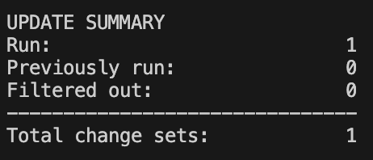

<div align="center">
  <h2>liquibase-nestjs</h2>
  <p>A simple library for applying Liquibase in NestJS</p>
</div>

[English](../README.md) | 한국어

1. [설치](#설치)
2. [사용 방법](#사용-방법)
3. [안내](#안내)

## 설치
```
npm install nestjs-liquibase
```

## 사용 방법

**1.`Liquibase Changelog` 작성**

적용 방법은 아래와 같은 구조를 기반으로 설명합니다. 만약 다른 디렉터리 구조로 적용하실 경우, 다른 디렉터리 정보로 적용되어야 합니다.
```
src/db/root.yaml
src/db/changelog/*.sql
```

자세한 사항은 `/examples` 를 참고하세요.

**2. `LiquibaseModule` 추가하기**
```typescript
@Module({
    imports: [
        // ...
        LiquibaseModule.regsiter({
            allow: true,
            config: {
                ...
            }
        })
    ],
})
export class AppModule {}
```

- `LiquibaseModule.register()` 의 파라미터에는 `LiquibaseDynamicConfig` 타입의 파라미터가 필요합니다. 
- `config`는 [liquibase](liquhttps://www.npmjs.com/package/liquibaseibase) 패키지 기반의 [LiquibaseConfig](https://github.com/liquibase/node-liquibase/blob/master/src/models/liquibase-config.model.ts) 타입입니다. 필요한 옵션을 자유롭게 설정할 수 있습니다.

LiquibaseDynamicConfig Example
```ts
LiquibaseModule.register({
    allow: true,
    config: {
      searchPath: "dist/db",
      changeLogFile: "root.yaml",
      url: "jdbc:postgresql://localhost:5432/postgres",
      username: "postgres",
      password: "mypassword", 
    }
  })
```

- `LiquibaseModule.registerAsync()`를 사용하여 추가할 수도 있습니다.

**3. `nest-cli.json` 수정**
NestJS 서버 시작 시, Liquibase 관련 파일을 빌드 결과물에 복사합니다.

```json
...
"compilerOptions": {
    "assets" : [
      {
        "include" : "db/root.yaml",
        "outDir" : "dist"
      },
      {
        "include": "db/changelog/*",
        "outDir": "dist"
      }
    ],
}
...


```

그럼 빌드 결과 디렉터리(`ourDir`) 에 다음과 복사됩니다.
```
dist
  ㄴ db
    ㄴ root.yaml
    ㄴ changelog
      ㄴ create_member.sql 
```

**4. 서버 실행**
```
npm run start
```
> Console Output



## 안내
- 현재 LiquibaseModule은 Liquibase의 update 명령어를 수행합니다.
